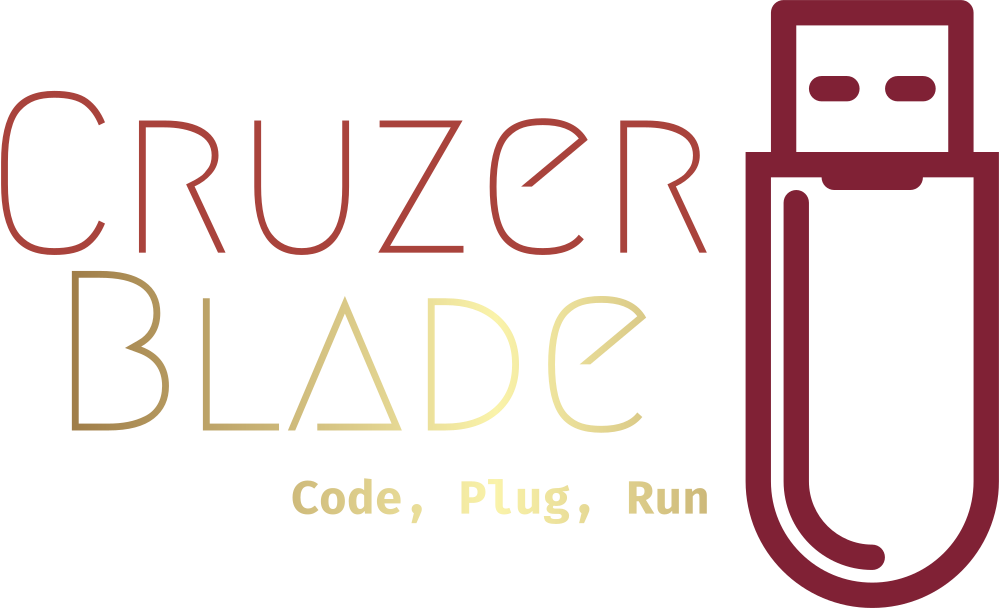
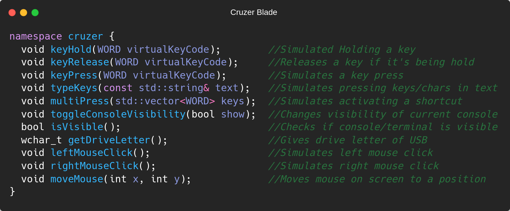

 
 

-blue) 

 
 
<h3>Turn any innocent USB drive, into a deadly virus.</h3>

 

<h3>
The Cruzer Blade — Just a  flash drive to humans — abuses this trust to deliver powerful payloads, injecting keystrokes at superhuman speeds.
</h3>

<h2>Installation</h2>
<h4>Install any compiler, copy the repo, start hacking.</h4>

 
<h3>C++</h3>
<h4>Code in a high level language, simple to code, easy to understand.</h4>

<h3>Compatibility</h3>
<h4>Have old dusty code? Integrate it to Cruzer Blade. A game? A software? Or File Viewer? Anything... Everywhere</h4>

<h3>Storage And Code</h3>
<h4>Use like a default USB memory stick, or a dangerous device.</h4>

<h2>List Of Functions</h2>
<h4>There are couple of useful functions for you to use.</h4>

<h3>Thanks for selecting us!</h3>
<h4>Made by ~cM</h4>
<h5>More Info: </h5>

<h5>Other links : </h5>
<a href="https://discord.gg/5W4XtHkc6g">Discord</a>
<a href="https://github.com/cMardc">Github</a>
<a href="https://stackoverflow.com/users/21458468/merd-ceferzade">Stack Overflow</a>

